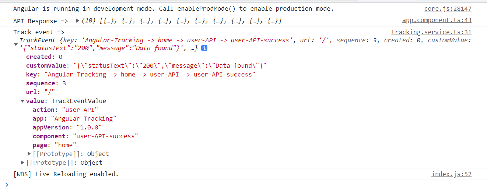

# Angular Tracking User Activity
User activity tracking is the process of monitoring, collecting, and analyzing visitor browsing behavior on a website or app.
Using this customize use activity tracker, you can track user's events like clicking, mouseover, API calling etc. You can modify further as per your requirements.

Also you can save the user activity data in database by calling tracking API.

There have two ways by which you can track user activities. 1. calling track function from TS file 2. Pass data through tracking directive

[![Open in StackBlitz]](https://stackblitz.com/edit/angular-ivy-fhfbv6?embed=1&file=src/app/app.component.ts)

## Tracking directive
You can pass trackingId or componentName. calling track function using @HostListener for Click event


```
import { Directive, HostListener, Input } from '@angular/core';
import { TrackingService } from '../services/tracking.service';

@Directive({
  selector: '[appTracking]'
})
export class TrackingDirective {
  @Input() componentName: string;
  @Input() trackingId: string;

  constructor(private trackingService: TrackingService) { }

  @HostListener('click', ['$event']) clickEvent(event: any) {
    this.trackingService.track(event.type, this.trackingId? this.trackingId: this.componentName);
  }

}
```

## Tacking from TS file


app.component.ts
```
export class AppComponent {
  title = 'angular-tracker';
  data: User[];
  customValue = {
    statusText: '',
    message: ''
  };
  constructor(
    private apiService: ApiService,
    private trackingService: TrackingService) {
    this.callAPI();
  }

  callAPI() {
    
      this.apiService
        .getUsers()
        .pipe(
          catchError((error) => {
            this.customValue = {
              statusText: error.statusText,
              message: error.message
            };
            this.trackingService.track('user-API', `user-API-error-${error.status}`, JSON.stringify(this.customValue));
            return throwError(error);
          })
        )
        .subscribe({
          next: (data) => {
            if (data?.length > 0) {
              console.log('API Response => ', data);
              this.customValue = {
                statusText: '200',
                message: 'Data found'
              };
              this.trackingService.track('user-API', 'user-API-success', JSON.stringify(this.customValue));
              this.data = data;
            } else {
              this.customValue = {
                statusText: '200',
                message: 'Data not found'
              };
              this.trackingService.track('user-API', `user-API-repone-blank`, JSON.stringify(this.customValue));
              console.log('Blank reponse');
            }
          },
        });
  }
}
```

## Tracking Service
- Initialize tracking service using initialize() to be active when angular application is loaded.
* track function by passing actionName name, trackingId (component / action decription) and customValue (optional).
+ track function is calling buildEventRequest function to create request body to call callToTrackAPI function
+ callToTrackAPI stores data in database

```
export class TrackingService {
  public initialized = false;

  private trackingUrl = '';

  constructor(
    private sharedService: SharedService,
    private http: HttpClient
  ) {
    this.initialize();
  }

  private initialize() {
    this.trackingUrl = this.sharedService.getTrackingUrl();
    this.initialized = true;
  }

  public track(actionName: string, trackingId: string, customValue?: string) {
    const event = this.buildEventRequest(actionName, trackingId, customValue ? customValue : '');
    console.log('Track event => ', event);
    this.callToTrackAPI(event).pipe(
      timeout(300),
      catchError((error) => of({ error }))
    ).subscribe();
  }

  private callToTrackAPI(event: TrackEvent) {
    if (!this.initialize || this.trackingUrl?.indexOf('undefined') >= 0) {
      return of({});
    }
    // Call API to save tracking data in database
    const headers = new HttpHeaders().set('Content-type', 'application/json');
    return this.http.post(this.trackingUrl, event, { headers });
  }

  private buildEventRequest(
    actionName: string,
    trackingId: string,
    customValue: string
  ) {
    const page = this.pageBuilder(location.pathname);
    if (!trackingId) {
      trackingId = 'component-undefined';
    }
    const key = this.keyBuilder(
      AppInfo.appName,
      actionName,
      trackingId,
      page
    );
    return this.createTrackEvent(
      key,
      actionName,
      trackingId,
      page,
      customValue
    );
  }

  private createTrackEvent(
    key: string,
    actionName: string,
    trackingId: string,
    page: string | null,
    customValue?: string
  ): TrackEvent {
    const result: TrackEvent = new TrackEvent();
    result.key = key;
    result.url = location.pathname;
    result.sequence = this.sharedService.getTrackingSequence();
    result.created = this.sharedService.getCurrentTime();
    result.customValue = customValue ? customValue : '';
    result.value = this.createTrackEventValue(actionName, trackingId, page);
    return result;
  }

  createTrackEventValue(
    actionName: string,
    trackingId: string,
    page: string | null
  ): TrackEventValue {
    const trackEventValue = new TrackEventValue();
    trackEventValue.action = actionName;
    trackEventValue.component = trackingId;
    trackEventValue.page = page;
    trackEventValue.app = AppInfo.appName;
    trackEventValue.appVersion = AppInfo.appVersion;
    return trackEventValue;
  }

  private keyBuilder(
    appName: string,
    actionName: string,
    trackingId: string,
    page: string | null
  ): string {
    return `${appName} -> ${page} -> ${actionName} -> ${trackingId}`;
  }

  pageBuilder(pageName: string) {
    const regex = /\/([a-zA-Z]+).*/;
    if (pageName === '/') {
      return 'home';
    } else {
      const pageNameBuilt = regex.exec(pageName);
      return pageNameBuilt ? pageNameBuilt[1] : null;
    }
  }
}
```
